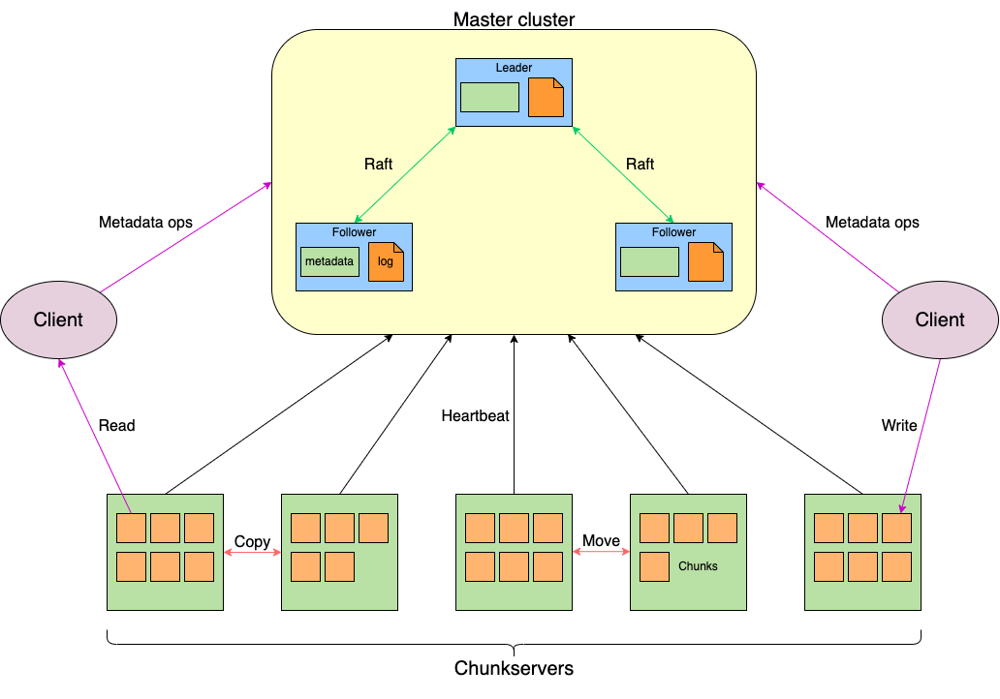
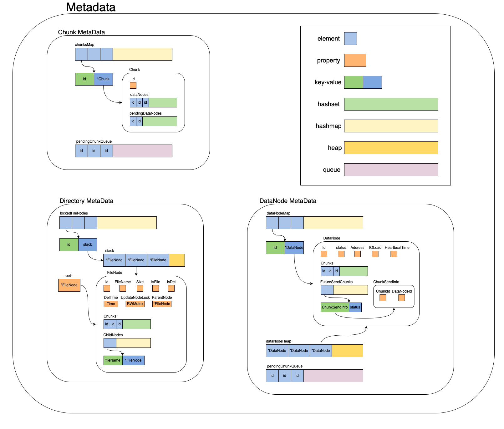

# CatDFS

CatDFS是一个使用Golang实现轻量级的开源分布式文件系统。它参考了[《The Google File System》](https://static.googleusercontent.com/media/research.google.com/zh-CN//archive/gfs-sosp2003.pdf)
以及[HDFS](https://github.com/apache/hadoop)，并在其基础上进行了改进与取舍。



此项目包含四个子项目，分别为：
* [master](https://github.com/zzhtttsss/tinydfs-master):master项目，系统的逻辑中心，负责管理chunkserver和元数据，类似于HDFS中的NameNode。
* [chunkserver](https://github.com/zzhtttsss/tinydfs-chunkserver):chunkserver项目，负责存储文件的节点，类似于HDFS中的DataNode。
* [client](https://github.com/zzhtttsss/tinydfs-client):客户端项目，用户通过它于文件系统进行交互。
* [base](https://github.com/zzhtttsss/tinydfs-base):基石项目，包含各个子项目通用的方法，常量以及protocol部分，各个子项目均依赖于它。


作为一个分布式文件系统，CatDFS主要具备以下特点：
- 文件操作——上传文件(add)，下载文件(get)，移动文件(move)，删除文件(remove)，获取文件信息(stat)，打印目录(list)，重命名(rename)，未来还将会支持追加写入(append)。
- 高可靠性——文件以多副本的放置策略存储于不同的chunkserver中，副本数可以作为参数调整。
- 高可用性——存储元数据的master多节点部署，并采用raft分布式共识算法保证元数据一致性。只要master节点可用数量超过一半，系统就仍能正常运作，不存在单点故障。
- 缩容管理——当chunkserver故障时，系统会判断是否需要执行缩容操作，将数据节点上存储的文件根据策略转移至其他chunkserver上，确保不会丢失副本。
- 扩容管理——用户可以随时新增chunkserver，系统会根据策略将其他chunkserver上的文件转移过来。
- 负载均衡——在用户上传文件，系统缩容和扩容时，系统会寻找最优策略选取恰当的chunkserver放置文件，使各个chunkserver的磁盘使用量基本均衡。
- 崩溃恢复——master节点和chunkserver节点崩溃后重启都可以无需配置直接加入系统，其上存储的信息也都不会丢失。
- 系统监控——采用`Cadvisor`+`Prometheus`+`Grafana`对系统的各项运行指标和负载状况进行可视化监控。

作为一个适合新人入门的项目，CatDFS主要具备以下特点：
- 完备的功能特性——实现了一个分布式文件系统所需要的大部分功能和特性，有助于了解和学习分布式系统及相关依赖组件。
- 简单的系统架构——采用尽可能简洁的结构构建系统，尽可能做减法而不是做加法。
- 清晰的设计思路——提供完整的设计文档，包含了各个元数据和机制的设计，便于快速掌握系统的设计原理。
- 详细的代码注释——绝大多数函数和属性都有较为详尽的英文注释，帮助理解各个函数和变量的作用。

<!-- TOC -->
* [CatDFS](#catdfs)
  * [背景](#)
  * [设计](#)
    * [整体架构](#)
      * [Master](#master)
      * [Chunkserver](#chunkserver)
      * [Client](#client)
    * [元数据](#)
      * [Chunk元数据](#chunk)
      * [DataNode元数据](#datanode)
      * [文件树](#)
    * [高可用性](#)
    * [文件传输](#)
    * [缩容](#)
    * [扩容](#)
  * [效果示例](#)
  * [安装](#)
  * [维护者](#)
  * [使用许可](#)
<!-- TOC -->

## 背景

CatDFS主要由两个硕士(同时也是菜鸟软件工程师)[@zzhtttsss](https://github.com/zzhtttsss)和[@DividedMoon](https://github.com/dividedmoon)
从零开始独立设计并实现。我们的目的主要是锻炼自己独立设计和编写项目的能力，并熟悉分布式系统，Raft算法和各个依赖组件。
这是我们首次在Github上发布独立实现的项目，因为我们也是初学者，在开发过程中，遇到问题的解决方式有限， 甚至是一边学习一边解决，
所以不足之处还望谅解。欢迎大家对CatDFS提出各种建议和问题，我们很希望这个项目能帮助新人学习相关知识，接下来我们也将会持续改进维护CatDFS～

这个项目使用 `Golang` 开发，为了模拟分布式环境，使用 `Docker` 进行测试。在`Docker compose`中，我们部署了`3`个`master`、
`5`个`chunkserver`，`Ectd`作为服务注册和发现的组件，`Cadvisor`+`Prometheus`+`Grafana`作为可视化监控的组件。

## 安装

1. 将各个模块编译为`docker`镜像，在各个模块的目录下：

```bash
docker build -t [name] .
```

2. 运行`docker compose`文件：
```bash
docker compose -f [compose.yaml] up -d
```

## 设计

### 整体架构

CatDFS主要由三部分组成，Master，Chunkserver和Client。各个部分之间均采用GRPC进行通信。

#### Master

Master是整个系统的中枢节点，负责维护系统的元数据（主要包括Chunk信息，chunkserver信息和文件树）。为了保证高可用性，
Master采取多节点部署策略，并使用Raft共识算法（通过[hashicorp/raft](https://github.com/hashicorp/raft)实现）
保证Master多节点间的元数据一致性，并采用[hashicorp/raft](https://github.com/hashicorp/raft)自带
的日志持久化方式来完成元数据持久化。所有Master节点都会将自己的地址添加到Etcd中以确保Client和Chunkserver可以找到
它们。Master不会主动向Chunkserver发送命令，而是在接受Chunkserver的心跳时与Chunkserver同步信息，刷新元数据以及
分配文件发送任务。Master还会接受Client的请求，根据用户请求查找或是修改元数据。

#### Chunkserver

Chunkserver是系统的存储节点，负责实际存储用户上传的文件。但是Chunkserver上存储的不是整个的文件而是固定大小（64MB）的Chunk，
每个文件都会被切成等大的Chunk，每个Chunk按照用户设定的副本数量存在多个Chunkserver中。Chunkserver会定期向Master发送心跳，
并通过心跳与Master交换信息。Chunkserver与其他Chunkserver和Client之间会通过建立管道传输C和接受Chunk。


#### Client

Client是供用户使用的客户端，用户通过客户端向系统发送各个指令。具体而言，Client会向Master请求获取或修改元数据，
与Chunkserver建立管道传输和接受Chunk。


### 元数据

CatDFS的元数据主要可分为三部分：Chunk元数据，DataNode（即Chunkserver）元数据和文件树。

#### Chunk元数据

Chunk元数据中主要包括chunksMap和pendingChunkQueue。chunksMap包含了当前系统中储存的所有Chunk以实现对Chunk O(1)的查找。
每个Chunk中会使用两个set分别存有当前已经存储该Chunk的DataNode（dataNodes），和已经分配了存储该Chunk但尚未确认储存完成的DataNode（pendingDataNodes）。
pendingChunkQueue是一个线程安全的队列，其中存有当前所有缺少副本等待系统分配的Chunk，每个Chunk在队列中出现一个即代表这个Chunk当前缺少一个副本。

#### DataNode元数据

DataNode元数据中主要包括dataNodeMap和dataNodeHeap。dataNodeMap包含了当前系统中所有尚未死亡的DataNode
（也就是Chunkserver）以实现对DataNode O(1)的查找。每个DataNode会用一个set记录该DataNode存有的Chunk（Chunks），
用一个map记录所有尚未确认完成的Chunk发送任务（FutureSendChunks）。

#### 文件树

文件树采用前缀树（Trie）结构，每一个节点代表一个目录或文件，每个节点会存储自己的父亲节点和儿子节点（通过map）。
每次查找都会根据文件名沿树查找，平均时间复杂度为O(1)。



### 高可用性

CatDFS的Master节点高可用性主要采用由Raft共识算法保证元数据一致性的Master多节点方案（基于[hashicorp/raft](https://github.com/hashicorp/raft)实现）。


### 文件传输


### 缩容


### 扩容


## 示例


## 维护者

[@zzhtttsss](https://github.com/zzhtttsss)

[@DividedMoon](https://github.com/dividedmoon)

## 使用许可

[GPL](LICENSE) © Richard Littauer
